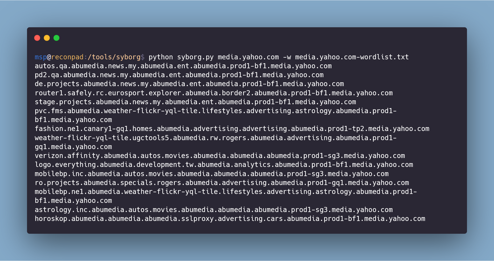

# Syborg
Syborg is a Recursive DNS Domain Enumerator which is neither active nor completely passive. This tool simply constructs a domain name and queries it with a specified DNS Server.

Syborg has a Dead-end Avoidance system inspired from [@Tomnomnom](https://github.com/tomnomnom/hacks)'s [ettu](https://github.com/tomnomnom/hacks). 

When you run subdomain enumeration with some of the tools, most of them passively query public records like `virustotal`, `crtsh` or `censys`. This enumeration technique is really fast and helps to find out a lot of domains in much less time.

However, there are some domains that may not be mentioned in these public records. In order to find those domains, Syborg interacts with the nameservers and recursively brute-forces subdomain from the DNS until it's queue is empty. 


Image Credits: [Carbon](https://carbon.now.sh)

As mentioned on [ettu](https://github.com/tomnomnom/hacks)'s page, I quote:

> Ordinarily if there are no records to return for a DNS name you might expect an `NXDOMAIN` error:
> ```bash
> ▶ host four.tomnomnom.uk
> Host four.tomnomnom.uk not found: 3(NXDOMAIN)
> ```
> You may have noticed that sometimes you get an empty response instead though:
> ```bash
> ▶ host three.tomnomnom.uk
> ```
> The difference in the latter case is often that another name - one that has your queried name as a suffix - exists and has records to return
> ```bash
> ▶ host one.two.three.tomnomnom.uk
> one.two.three.tomnomnom.uk has address 46.101.59.42
> ```
> This difference in response can be used to help avoid dead-ends in recursive DNS brute-forcing by not recursing in the former situation:
> ```bash
> ▶ echo -e "www\none\ntwo\nthree" | ettu tomnomnom.uk
> one.two.three.tomnomnom.uk
> ```

Syborg incorporates all of these functionalities with simple concurrency and recursion.

## Requirements:

Python 3.x (Recommended)

Python 2.x (Not tested)

## Installation:

Clone the repo using the `git clone` command as follows:

```bash
git clone https://github.com/MilindPurswani/Syborg.git
```

Resolve the Dependencies:

```bash
pip3 install -r requirements.txt
```

## Usage:

```bash
python3 syborg.py yahoo.com 
```

## Recommended Smart Usage:

Although Syborg can discover many subdomains, it is still a brute-forcer after all (although not dumb). So, the more domain specific the wordlist, the less time to produce optimal results. In order to generate optimal list, it is recommended to generate a passive scan wordlist. One such way of doing that is as follows:

```bash
assetfinder --subs-only media.yahoo.com | tok -delim-exceptions=- | sort -u | tee -a media.yahoo.com-wordlist.txt
```

*In order to execute this command, one should have installed [`assetfinder`](https://github.com/tomnomnom/assetfinder) and [`tok`](https://github.com/tomnomnom/hacks)*

Or, one can also you any other passive subdomain enumerator such as [`Sublist3r`](https://github.com/aboul3la/Sublist3r) by executing following command

```bash
python sublist3r.py -d media.yahoo.com -o domains.txt
cat domains.txt | sed 's/[.]/\n/g' | sort -u | tee -a media.yahoo.com-wordlist.txt
```

Then execute Syborg as follows:

```bash
python3 syborg.py media.yahoo.com -w media.yahoo.com-wordlist.txt -c 20 -o results.txt -v
```

It doesn't depend on what passive enumeration tool is used, the whole point is to generate a domain specific wordlist for the current asset.

Here is the list of arguments that can be used:

````bash
usage: syborg.py [-h] [-d DNS] [-w WORDLIST] [-o OUTPUT] [-c CONCURRENCY] [-v]
                 domain

positional arguments:
  domain                domain name of the target

optional arguments:
  -h, --help                                 show this help message and exit
  -d DNS, --dns DNS                          DNS Server to be used (default: 8.8.8.8)
  -w WORDLIST, --wordlist WORDLIST           Specify a custom wordlist (default: wordlist.txt)
  -o OUTPUT, --output OUTPUT                 Specify the output file (default: results-domain.txt)
  -c CONCURRENCY, --concurrency CONCURRENCY  Specify the level of concurrency (default: 10)
  -v, --verbose                              increase output verbosity
````


**At times, it is also possible that Syborg will hit High CPU Usage and that can cost you a lot if you are trying to use this tool on your VPS. Therefore to limit that use another utility called Cpulimit**

```bash
cpulimit -l 50 -p $(pgrep python3)
```

This tool can be downloaded as follows:

```bash
sudo apt install cpulimit
```


## Special Thanks <3:

1. [@nahamsec](https://twitter.com/nahamsec) for his invaluable contribution towards the community by live streams. Check out his twitch channel https://twitch.tv/nahamsec

2. [@tomnomnom](https://twitter.com/tomnomnom) for making such awesome tools and sharing with everyone. Be sure to check out his twitch  https://www.twitch.tv/tomnomnomuk

3. [@GP89](https://github.com/GP89) for the `FileQueue` lib that resolved high memory consumption problem with Syborg.

